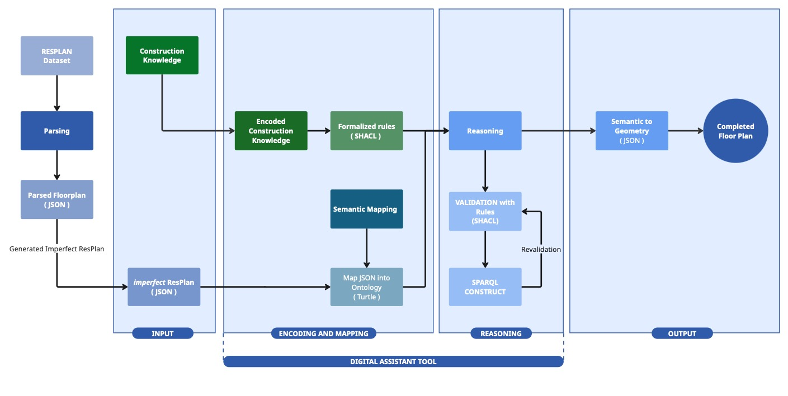

# Geometry-to-Ontology: Knowledge-Based Reconstruction of Imperfect Floor Plans

## Overview

This repository contains the implementation for a thesis framework that reconstructs missing structural elements in residential floor plans by combining geometric processing with semantic reasoning.

Target missing elements are primarily:
- interior walls,
- doors, and
- windows.

## Abstract
Floor plans are not merely geometric drawings but structured representations of spatial, functional, and regulatory knowledge. In early design and construction practice, the most essential thing for architects and engineers is complete, accurate data, particularly in reconstruction, renovation, and digitalization projects. However, architects and engineers frequently encounter incomplete data or damaged floor plans. While recent research has advanced the development of data-driven methods for generating floor plans and enriching building models with semantics, most approaches assume complete input data or focus on generating entirely new floor plans. The reconstruction of incomplete floor plans using structured domain knowledge remains underexplored.

This thesis proposes a knowledge-based inference framework that bridges geometric representations and semantic reasoning to support the reconstruction of missing structural elements in residential floor plans. This research investigates how preexisting construction knowledge, including building design guidelines and regulatory constraints, can be encoded into machine-readable ontologies and integrated into a semi-automated digital assistant pipeline. Using the ResPlan vector dataset as a case study, imperfect floor plans are systematically generated by removing selected elements such as interior walls, doors, and windows. These floor plans are mapped from JSON into a semantic knowledge graph based on existing ontologies. Construction knowledge is formalized using SHACL rules for validation and SPARQL CONSTRUCT queries for inference. The reasoning layer identifies violations caused by missing elements and reconstructs instances based on the topology context found in the floor plan. Inferred semantic elements are then translated back into geometric representations.

The results demonstrate that construction knowledge can be encoded as explicit rules for detecting and reconstructing missing components. The reversible transformation between geometry and semantics preserves spatial metadata while enabling constraints-based reasoning. Although dataset inconsistencies and semantic-to-geometric generalization remain limitations, the proposed framework contributes a coherent alternative to purely data-driven methods and illustrates how domain knowledge can support damaged floor-plan reconstruction workflows.

## Research Scope
- **Input domain**: Residential floor plans (ResPlan-derived data).
- **Knowledge layer**: ResPlan ontology with BOT/IFC alignment.
- **Validation**: SHACL constraints for checking data violations.
- **Inference**: SPARQL CONSTRUCT rules to generate missing elements.
- **Back-projection**: Semantic outputs translated back into geometry JSON.

## Repository Structure
- `data/`
  - source data (e.g., `ResPlan.pkl`)
- `output/`
  - `resplan_json/`: exported complete JSON floor plans
  - `imp_resplan_json/`: imperfect JSON variants (elements removed)
  - `imp_resplan_ttl/`: imperfect floor plans in Turtle
  - `inferred_resplan_ttl/`: inferred Turtle outputs
  - `inferred_resplan_json/`: inferred plans converted back to JSON geometry
- `ontology/`
  - `core/`: ontology definitions
  - `rules/`: SHACL rules
  - `construct/`: SPARQL CONSTRUCT inference queries
  - `json_to_ttl.py`: JSON -> RDF/Turtle mapping
- `thesis_package/`
  - geometry/graph/relation/circulation utilities
  - synthetic imperfect-plan generation
  - TTL -> JSON reconstruction utilities
- `Notebooks/`
  - end-to-end experiment workflow and analysis

## Core Files
- Mapping and conversion:
  - `ontology/json_to_ttl.py`
  - `thesis_package/ttl_to_json.py`
- Imperfect plan generation:
  - `thesis_package/synthetic.py`
- Inference queries:
  - `ontology/construct/InteriorWallConstruct.rq`
  - `ontology/construct/DoorConstruct.rq`
  - `ontology/construct/WindowConstruct.rq`
- SHACL rules:
  - `ontology/rules/AdjacencyRule.shacl.ttl`
  - `ontology/rules/DoorRule.shacl.ttl`
  - `ontology/rules/WindowRule.shacl.ttl`
  - `ontology/rules/[Archived]ConnectivityRule.shacl.ttl`

## End-to-End Workflow
1. Export/prepare floor-plan JSON artifacts.
2. Generate imperfect variants by dropping selected structural elements.
3. Convert imperfect JSON to Turtle (`json_to_ttl.py`).
4. Run SHACL validation 
5. SPARQL CONSTRUCT inference and Revalidation.
5. Convert inferred Turtle back to geometry-oriented JSON.
6. Evaluate reconstruction and inspect before/after topology.

## Setup
### Option A: Conda
```bash
conda env create -f environment-thesis.yml
conda activate geometry-to-ontology-thesis
```
### Option B: Pip
```bash
pip install -r requirements-thesis.txt
```

## Run full experiments
Use the notebooks as orchestrators:
- `Notebooks/1_visualization.ipynb` : Export floor plan to JSON, Generate imperfect floor plan, map json into turtle, validation pre-inference
- `Notebooks/2_Inference.ipynb` : Inference, Revalidation
- `Notebooks/3_togeometry.ipynb` : Semantic to geometry
- `Notebooks/4_All Structural.ipynb` : End-to-end pipeline for the missing all structural scenario

## Notes on Current Project State
- The notebook workflow is the primary reproducible path.
- `thesis_package/main.py` is currently a placeholder and not the canonical experiment runner.
- Some outputs are already pre-generated under `output/`.

